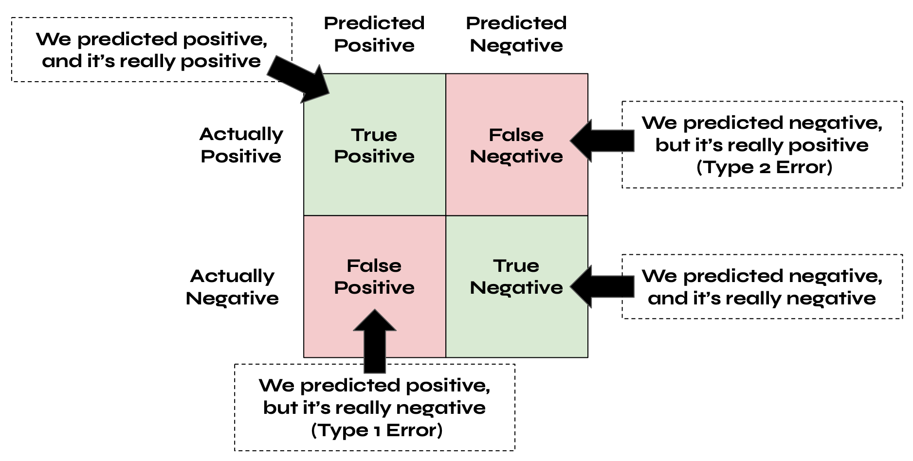
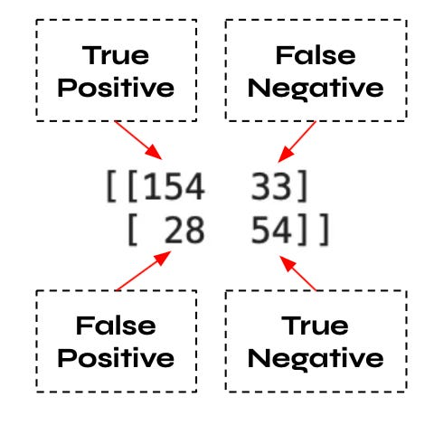
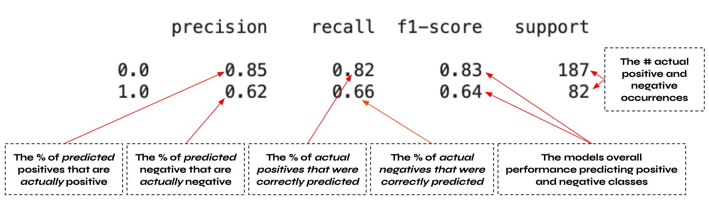

# What Are Evaluation (Performance) Metrics?

In a previous tutorial titled [Evaluating Machine Learning Models: An Introduction to Resampling Methods](https://github.com/evanpeikon/machine-learning/tree/main/resampling), I discussed evaluation methods, which estimate how well a given machine learning algorithm will perform at making predictions about unseen data. Example evaluation methods include train-test splitting, k-fold cross-validation, and leave one out cross-validation.

Whereas evaluation methods estimate a model's performance on unseen data, evaluation metrics are the statistical techniques employed to quantify how well the model works. Thus, to evaluate a machine learning algorithm, we must select an evaluation method and evaluation metric(s). 

In the aforementioned tutorial I covered a handful of common evaluation methods, using accuracy as the chosen evaluation metric in each case. In this tutorial, I will focus on classification problems, using the Pima Diabetes dataset for my demonstrations. The Pima Diabetes dataset is a binary classification problem with numerical output classes (0 = no diabetes and 1 = diabetes). Additionally, in all of the code examples, I will use the same algorithm (logistic regression) and evaluation method (k-fold cross-validation) while demonstrating the following evaluation metrics:
- **Classification accuracy**, which is the percent of all predictions made correctly;
- A **confusion matrix**, which is a table summarizing the prediction results for a classification problem;
- A **classification report**, which provides a convenient snapshot of a machine learning model’s performance on classification problems;
- The **area under the ROC curve**, which represents a machine learning model’s ability to accurately discriminate between output classes; and
- **Logistic loss**, which represents the confidence for a given algorithms predictive capabilities.

# Classification Accuracy:

Classification accuracy is the percentage of all predictions that are made correctly. 

Because it's so easy to calculate and interpret, classification accuracy is the most commonly used evaluation metric for classification problems. However, classification accuracy is only effective when there are equal numbers of observations in each output class, which is seldom the case, and thus classification accuracy is often misused. For example, let's say we have 100 patients, 10 of whom are diseased. Our machine learning algorithm predicted that 95 patients were healthy and 5 were diseases. In this case, our classification accuracy would be 90%, which while true, is misleading given that we misclassified 50% of diseased patients (a catastrophic outcome in real life). 

Below you'll find sample code using classification accuracy (in conjunction with k-fold cross-validation) to determine the effectiveness of a machine learning model:
```
# Import libraries
from pandas import read_csv
from sklearn.model_selection import KFold
from sklearn.model_selection mport cross_val_score
from sklearn.linear_model import LogisticRegression

# Load data
filename = 'diabetes.csv'
names = ['pregnancies', 'glucose', 'DBP', 'skinfold','insulin','BMI','diabetes_pedigree','age','outcome']
data = read_csv(filename, names=names)

# create array w/ data and seperate array into input/outputs
array = data.values # inputs = all rows in columns 0-7
x = array[:,0:8] # output = all rows in column 8
y= array[:,8]

# Set algo (logistic regression) and evaluation method (k-fold cv)
kfold = KFold(n_splits=10, random_state=5, shuffle=True)
model = LogisticRegression(solver= 'liblinear')

# Set performance metric and evaluate model
score = 'accuracy'
results = cross_val_score(model, x, y, cv=kfold, scoring=score)
print('Mean Accuracy:', results.mean()*100)
print('Accuracy Std.Dev.:', results.std())
```
Which results in the following outputs:
- Mean Accuracy: 77.08%
- Accuracy Std.Dev.: 0.05

# Confusion Matrix:
A confusion matrix is a table that summarizes the prediction results for a classification problem with the predicted values on the x-axis and actual values on the y-axis, as demonstrated below:


For example, let's say we're predicting whether or not a patient has COVID. If we predict the patient is COVID-positive, and they do have COVID, then it's a true positive. However, if we predict the patient is COVID-positive but they do not have COVID, then it's a false positive (type 1 error). 

Below you'll find a sample code generating confusion matrix for the Pima Diabetes dataset:
```
# Import libraries
from pandas import read_csv
from sklearn.model_selection import tran_test_split
from sklearn.model_selection mport LogisticRegression
from sklearn.linear_model import confusion_matrix

# Load data
filename = 'diabetes.csv'
names = ['pregnancies', 'glucose', 'DBP', 'skinfold','insulin','BMI','diabetes_pedigree','age','outcome']
data = read_csv(filename, names=names)

# Create array w/ data and seperate array into input/outputs
array = data.values # inputs = all rows in columns 0-7
x = array[:,0:8] # output = all rows in column 8
y= array[:,8]

# Create train-test split
test_split = 0.35 # Sets the test split's size to 35% of dataset
x_train, x_test, y_train, y_test = train_test_split(x,y,test_size=test_split, random_state=seed)

# Craeate and fit model
model = LogisticRegression(solver= 'liblinear')
model.fit(x_train,y_train)

# Make predictions and generate confusion matrix
predictions = model.predict(x_test)
confusion_matrix = confusion_matrix(y_test, predictions)
print(confusion_matrix)
```
Which results in the following output (with added interpretations):



After generating a confusion matrix, you can manually calculate the precision, recall, and f1-score. 

Precision is the percentage of predicted positive cases that are actually positive or the percentage of predicted negative cases that are actually negative. As such, precision can be calculated as follows:
- **Positive Precision** = True Positive / (True Positive + False Positive)
- **Negative Precision** = True Negative / (True Negative + False Negative)
  
Recall, on the other hand, is the percentage of actual positive or negative cases that were correctly predicted. Recall can be calculated as follows:
- **Positive Recall** = True Positive / (True Positive + False Negative)
- **Negative Recall** = True Negative / (True Negative + False Positive)

Finally, we have the f1-score, representing the harmonic mean of the precision and recall scores. The f1-score is used to compare two different models with different levels of precision and recall, and the higher the f1-score, the better the model performed. A model’s f1-score is calculated as follows:
- **f1-score** = (2 * Precision * Recall) / (Precision + Recall)
  
Fortunately, the ski kit-learn library provides a simple way to calculate precision, recall, and the f1-score, which is covered in the next section

# Classification Report
A classification report provides a snapshot of a machine learning model’s performance on classification problems. Specifically, a classification report displays the precision, recall, f1-score, and support (the number of actual occurrences for a given class). One benefit of a classification report is that it’s easy to interpret - the higher the precision, recall, and f1-score, the better. 

Below you’ll find a sample code demonstrating how to generate a classification report using the Pima Diabetes dataset as an example: 
```
# Import libraries
from pandas import read_csv
from sklearn.model_selection import tran_test_split
from sklearn.model_selection mport LogisticRegression
from sklearn.linear_model import classification_report

# Load data
filename = 'diabetes.csv'
names = ['pregnancies', 'glucose', 'DBP', 'skinfold','insulin','BMI','diabetes_pedigree','age','outcome']
data = read_csv(filename, names=names)

# Create array w/ data and seperate array into input/outputs
array = data.values # inputs = all rows in columns 0-7
x = array[:,0:8] # output = all rows in column 8
y= array[:,8]

# Create train-test split
test_split = 0.35 # Sets the test split's size to 35% of dataset
x_train, x_test, y_train, y_test = train_test_split(x,y,test_size=test_split, random_state=seed)

# Create and fit model
model = LogisticRegression(solver= 'liblinear')
model.fit(x_train, y_train)

# Make predictions and generate classification report
predictions= model.predict(x_test)
CR = classification_report(y_test, predictions)
print(CR)
```
Which generates the following output (with added interpretations):


# Area Under The Rate of Change Curve
The area under the ROC curve is an evaluation metric for binary classification problems representing a machine learning model's ability to discriminate between output classes. A model's area under the ROC curve is scored from 0.5 to 1.0, where higher scores indicate a greater ability to make correct predictions. For example, a score of 1.0 would mean that a machine learning model perfectly identifies patients with/without a disease, whereas a score of 0.5 would equate to random guessing. 

Below you’ll find a sample code to calculate the area under the ROC curve using the Pima Diabetes dataset as an example:
```
# Import libraries
from pandas import read_csv
from sklearn.model_selection import KFold
from sklearn.model_selection mport cross_val_score
from sklearn.linear_model import LogisticRegression

# Load data
filename = 'diabetes.csv'
names = ['pregnancies', 'glucose', 'DBP', 'skinfold','insulin','BMI','diabetes_pedigree','age','outcome']
data = read_csv(filename, names=names)

# create array w/ data and seperate array into input/outputs
array = data.values # inputs = all rows in columns 0-7
x = array[:,0:8] # output = all rows in column 8
y= array[:,8]

# Set algo (logistic regression) and evaluation method (k-fold cv)
kfold = KFold(n_splits=10, random_state=5, shuffle=True)
model = LogisticRegression(solver= 'liblinear')

# Set performance metric (Area under ROC curve) and evaluate model
score = 'roc_curve'
results = cross_val_score(model,x,y,cv=kfold,scoring=score)
print('Area under ROC curve mean:', results.mean())
print('Area under ROC curve SD:', results.std())
```
Which results in the following output:
- Area under ROC curve mean: 0.825
- Area under ROC curve SD: 0.0500

# Logistic Loss
Logistic loss (aka logloss) is an evaluation metric that assess the predictions of probabilities of membership to a given output class. Logistic loss represents the confidence for a given algorithms predictive capabilities and is scored from 0-1. Additionally, correct and incorrect predictions are rewarded in proportion to the confidence of the prediction.

The closer the logloss score is to 1, then more the predicted probability diverges from the actual value. Alternatively, a logloss value of 0 indicates perfect predictions.

Below you’ll find a sample code to calculate logistic loss using the Pima Diabetes dataset as an example:
```
# Import libraries
from pandas import read_csv
from sklearn.model_selection import KFold
from sklearn.model_selection mport cross_val_score
from sklearn.linear_model import LogisticRegression

# Load data
filename = 'diabetes.csv'
names = ['pregnancies', 'glucose', 'DBP', 'skinfold','insulin','BMI','diabetes_pedigree','age','outcome']
data = read_csv(filename, names=names)

# create array w/ data and seperate array into input/outputs
array = data.values # inputs = all rows in columns 0-7
x = array[:,0:8] # output = all rows in column 8
y= array[:,8]

# Set algo (logistic regression) and evaluation method (k-fold cv)
kfold = KFold(n_splits=10, random_state=5, shuffle=True)
model = LogisticRegression(solver= 'liblinear')

# Set performance metric (logloss) and evaluate model
score = 'neg_log_loss'
results = cross_val_score(model,x,y,cv=kfold,scoring=score)
print('Logloss Mean:', results.mean())
print('Logloss SD:', results.std())
```
Which results in the following output:
- Logloss Mean: -0.494
- Logloss SD: 0.042
