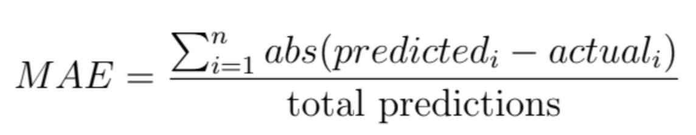
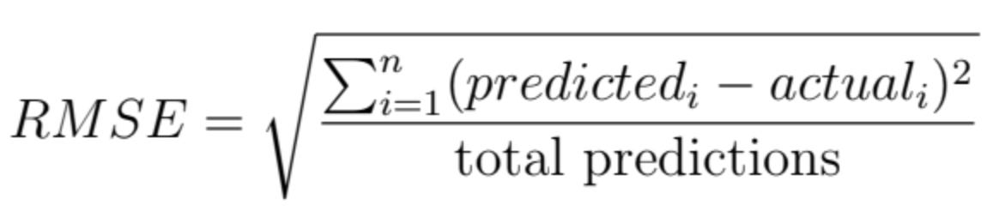

## Evaluation Metrics For Regression Problems

# What Are Evaluation (Performance) Metrics?
In a previous tutorial titled [Evaluating Machine Learning Models: An Introduction to Resampling Methods](https://github.com/evanpeikon/machine-learning/tree/main/resampling), I discussed evaluation methods, which estimate how well a given machine learning algorithm will perform at making predictions about unseen data. Example evaluation methods include train-test splitting, k-fold cross-validation, and leave one out cross-validation.


Whereas evaluation methods estimate a model's performance on unseen data, evaluation metrics are the statistical techniques employed to quantify how well the model works. Thus, to evaluate a machine learning algorithm, we must select an evaluation method and evaluation metric(s). 

In this tutorial, I will focus on a regression problem, using information about a medical patient’s age, sex, BMI, number of dependents, smoking status, and residential area within the United States to predict their individual medical costs billed by health insurance. Additionally, in all of the code examples, I will use the same algorithm (linear regression) and evaluation method (k-fold cross-validation) while demonstrating the following regression metrics:
- The **mean absolute error (MAE)**, which is the average of the sum of absolute errors in predicted values;
- The **root Mean squared error (RMSE)**, which is the square root of the mean of squared differences between actual and predicted outcomes; and
- **R²**, also known as the coefficient of determination, which is provides an indication of the goodness of fit of a set of predictions as compared to the actual values.

## Mean Absolute Error (MAE)
Regression is a data analysis technique that uses a known data point to predict a single unknown but related data point—for example, predicting someone's relative risk of stroke based on their systolic blood pressure. 

The mean absolute error (MAE) is an easy way to determine how wrong your predictions are when solving regression problems. Specifically, the MAE quantifies the error in your predicted values versus the actual, expected values. 

The mean absolute error is defined as the average of the sum of absolute errors. The term 'absolute' conveys that the error values are made positive, so they can be added to determine the magnitude of error. Thus, one limitation of MAE is that there is no directionality to the errors, so we don't know if we're over or underpredicting. 

The formula for mean absolute error (MAE) is as follows:



Below you'll find sample code calculating the mean average error of medical insurance cost predictions using a simple linear regression model to make predictions and k-fold cross-validation as an evaluation method: 

```
# (1) import libraries
fron pandas import read_csv
from sklearn.linear_model import LinearRegression
from sklearn.model_selection import KFold
from sklearn.model_selection import cross_val_score

# (2) load data
fileame = 'insurance.csv'
names = ['age', 'sex', 'bmi', 'dependents', 'smoker', 'region', 'cost']
data = read_csv(filename, names=names)

# (3) create array w/ data and seperate array into input/outputs
array = data.values
x = array[:, 0:6] # inputs = all rows in columns 0-6
y = array[:, 6] # output = all rows in column 7

# (4) set algo (linear regression) and evaluation method (kfcv)
model = LinearRegression()
kfold = KFold(n_splits=10, random_state=5, shuffle=True)

# (5) set performance metric and evaluate model
scoring = 'neg_mean_absolute_error'
results = cross_val_score(model, x, y, cv=kfold, scoring=scoring)
print('Min Cost:', y.min(), ', Max Cost:', y.max(), ', Avg Cost:', y.mean())
print('MAE (mean):', results.mean())
print('MAS (std.dev):', results.std())
```

Which produces the following outputs:
- Min Cost: 1121.87 , Max Cost: 63770.43 , Avg Cost: 13270.42
- MAE (mean): -4204.12
- MAE (std.dev): 188.64 

You’ll notice that the mean absolute error is negative, which is due to the metric being inverted by the cross_val_score( ) function. 

## Root Mean Squared Error (RMSE)

The root mean squared error (RMSE) is one of the most commonly used evaluation metrics for regression problems. 

RMSE is the square root of the mean of squared differences between actual and predicted outcomes. Squaring each error forces the values to be positive. Calculating the square root of the mean squared error (MSE) returns the evaluation metric to the original units, which is useful for presentation and comparison. 

The formula for root mean squared error (RMSE) is as follows:



Below you'll find sample code calculating the RMSE of medical insurance cost predictions: 

```
# (1) import libraries
fron pandas import read_csv
from sklearn.linear_model import LinearRegression
from sklearn.model_selection import KFold
from sklearn.model_selection import cross_val_score
from math import sqrt

# (2) load data
fileame = 'insurance.csv'
names = ['age', 'sex', 'bmi', 'dependents', 'smoker', 'region', 'cost']
data = read_csv(filename, names=names)

# (3) create array w/ data and seperate array into input/outputs
array = data.values
x = array[:, 0:6] # inputs = all rows in columns 0-6
y = array[:, 6] # output = all rows in column 7

# (4) set algo (linear regression) and evaluation method (kfcv)
model = LinearRegression()
kfold = KFold(n_splits=10, random_state=5, shuffle=True)

# (5) set performance metric and evaluate model
scoring = 'neg_mean_squared_error'
results = cross_val_score(model, x, y, cv=kfold, scoring=scoring)
MSE = results.mean()*-1 # calculate mean MSE
RMSE = sqrt(MSE) # calcualte RMSE from MSE
print('RMSE:', RMSE)
```

Which produces the following output:
- RMSE: 6098.37

The above examples show that the RMSE (6098) is slightly larger than the MAE (4204). RMSE values are always higher than MAE values because RMSE penalizes larger errors with worse scores. Thus, the difference between RMSE and MAE scores increases as prediction errors increase, which is the primary advantage of using RMSE as an evaluation metric. 

## R² (R Squared):
The R², also known as the coefficient of determination, is an evaluation metric that provides an indication of the goodness of fit of a set of predictions as compared to the actual values.

The R² metric is scored from 0 to 1, where 1 is a perfect score and 0 means the predictions are entirely random and arbitrary.

Below you'll find sample code calculating the R² of medical insurance cost predictions: 
```
# (1) import libraries
fron pandas import read_csv
from sklearn.linear_model import LinearRegression
from sklearn.model_selection import KFold
from sklearn.model_selection import cross_val_score

# (2) load data
fileame = 'insurance.csv'
names = ['age', 'sex', 'bmi', 'dependents', 'smoker', 'region', 'cost']
data = read_csv(filename, names=names)

# (3) create array w/ data and seperate array into input/outputs
array = data.values
x = array[:, 0:6] # inputs = all rows in columns 0-6
y = array[:, 6] # output = all rows in column 7

# (4) set algo (linear regression) and evaluation method (kfcv)
model = LinearRegression()
kfold = KFold(n_splits=10, random_state=5, shuffle=True)

# (5) set performance metric and evaluate model
scoring = 'r2'
results = cross_val_score(model, x, y, cv=kfold, scoring=scoring)
print('R² (mean):', results.mean())
print('R² (std.dev):', results.std())
```
Which produces the following outputs:
- R² (mean): 0.74
- R² (std.dev): 0.04


# 
PS - If you’re interested in learning about evaluation metrics for classification problems you can check out my previous tutorial, titled [Evaluation Metrics For Classification Problems](https://github.com/evanpeikon/Machine-Learning/tree/main/Classification-Metrics).
