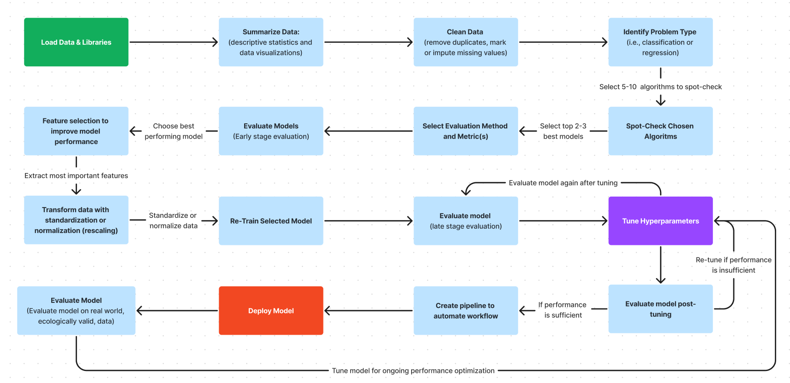

# An Introduction To Hyperparameter Optimization

## What Are Hyperparameters?

You can think of machine learning algorithms as systems with various knobs and dials, which you can adjust in any number of ways to change how output data (predictions) are generated from input data. The knobs and dials in these systems can be subdivided into parameters and hyperparameters. 

Parameters are model settings that are learned, adjusted, and optimized automatically. Conversely, hyperparameters need to be manually set manually by whoever is programming the machine learning algorithm. 

Generally, tuning hyperparameters has known effects on machine learning algorithms. However, it’s not always clear how to best set a hyperparameter to optimize model performance for a specific dataset. As a result, search strategies are often used to find optimal hyperparameter configurations. In this newsletter, I’m going to cover the following hyperparameter tuning methods: 
- **Grid Search** is a cross-validation technique for hyperparameter tuning that finds an optimal parameter value among a given set of parameters specified in a grid; and
- **Random Search** is a tuning technique that randomly samples a specified number of uniformly distributed algorithm parameters.

## Where Does Hyperparameter Tuning Fit In The Big Picture?

Before I show you how to use grid search and random search, you need to understand where these processes, or hyperparameter tuning more broadly, fit in the grand scheme of creating and deploying machine learning models. 

The image below visually represents the varying steps between identifying what type of machine learning problem you’re working with and deploying a functioning machine learning model that makes accurate predictions on unseen data. 

You can see that hyperparameter tuning is one of the final steps before you create a pipeline to automate your workflow and deploy your model, as demonstrated below:



## Hyperparameter Tuning With Grid Search

Grid Search is a cross-validation technique for hyperparameter tuning that finds an optimal parameter value among a given set of parameters specified in a grid. 

In a previous tutorial, [Comparing Machine Learning Algorithms](https://github.com/evanpeikon/Machine-Learning/tree/main/spot_checking), I spot-checked several different algorithms and compared their performance in predicting whether a patient has diabetes using the Pima Diabetes dataset. After spot-checking six different algorithms, I found that logistic regression and linear discriminant analysis (LDA) produced the best results. I then suggested that these algorithms be selected for tuning and optimization to enhance their ability to make accurate predictions. 

In the code sample below, I will perform grid search hyperparamter tuning to evaluate different solvers, penalties, and penalty strengths to see if we can improve the aforementioned logistic regression models performance:

```python
# import libraries
import pandas as pd
from sklearn.linear_model import LogisticRegression
from sklearn.model_selection import GridSearchCV

# load data
filename = 'diabetes.csv'
names = ['pregnancies', 'glucose', 'DBP', 'skinfold', 'insulin' ,'BMI' ,'diabetes_pedigree' ,'age' ,'outcome']
data = read_csv(filename, names=names)

# create array w/ data and seperate array into input/outputs
array = data.values # inputs = all rows in columns 0-7
x = array[:,0:8] # output = all rows in column 8
y= array[:,8]

# set model
model = LogisticRegression()

# select hyperparameters
solvers = ['newton-cg', 'lbfgs', 'liblinear', 'saga']
penalty = ['l2']
penalty_strength = [100, 10, 1.0, 0.1, 0.01]

# grid search parameter tuning
grid = dict(solver=solvers, penalty=penalty, C=penalty_strength)
grid = GridSearchCV(estimator=model, param_grid=grid, n_jobs=1, scoring='accuracy', error_score=0)
grid.fit(x,y)

# print results
print('Model Accuracy:', grid.best_score)
print('Best Solver:', grid.best_estimator.solver)
print('Best Penalty Strength:', grid.best_estimator_.C)
```
Which produces the following outputs:
- **Model Accuracy: 0.7721925133689839**
- **Best Solver: liblinear**
- **Best Penalty Strength: 100**

In my previous tutorial, Comparing Machine Learning Algorithms, logistic regression produced an accuracy score of 0.764. Thus hyperparameter tuning boosted our accuracy by 0.8% (since the model performance was already good, hyperparameter tuning did not result in a substantial change in accuracy).

## Hyperparameter Tuning With Random Search:
Random Search is a hyperparameter tuning technique that randomly samples a specified number of uniformly distributed algorithm parameters. 

In the code sample below, I will perform random search hyperparamter tuning to evaluate different solvers, penalties, and penalty strengths to see if we can improve the aforementioned logistic regression models performance:

```python
# import libraries
import pandas as pd
from sklearn.linear_model import LogisticRegression
from sklearn.model_selection import GridSearchCV

# load data
filename = 'diabetes.csv'
names = ['pregnancies', 'glucose', 'DBP', 'skinfold', 'insulin' ,'BMI' ,'diabetes_pedigree' ,'age' ,'outcome']
data = read_csv(filename, names=names)

# create array w/ data and seperate array into input/outputs
array = data.values # inputs = all rows in columns 0-7
x = array[:,0:8] # output = all rows in column 8
y= array[:,8]

# set model
model = LogisticRegression(solver = 'liblinear')

# create dictionary of hyperparameters
penalty_strength = [100, 10, 1.0, 0.1, 0.01]
penalty = ['l1', 'l2']
solvers = ['newton-cg', 'lbfgs', 'liblinear', 'saga']
hyperparameters = dict(C=penalty_strength, penalty=penalty, solver=solvers)

# grid search parameter tuning
randomizedsearch = RandomizedSearchCV(estimator=model, param_distributions=hyperparameters, n_iter=100, cv=3, random_state=7)
randomized_search.fit(x,y)

# print results
print('Best Score:', randomizedsearch.best_score_)
print('Best Solver:', randomizedsearch.best_estimator_.solver)
print('Best Penalty:', randomizedsearch.best_estimator_.penalty)
print('Best Penalty Strength:', randomizedsearch.best_estimator_.C)
```
Which produces the following outputs:
- **Best Score: 0.7734375**
- **Best Solver: lbfgs**
- **Best Penalty: l2**
- **Best Penalty Srrength: 100**

As previously mentioned, the baseline performance for our logistic regression model was 76.4%, and the model’s performance after grid search hyperparameter tuning was 77.2% (0.8% improvement from baseline). For comparison, we can see that random search produced a 1% improvement above baseline and a 0.2% improvement above grid search. 

