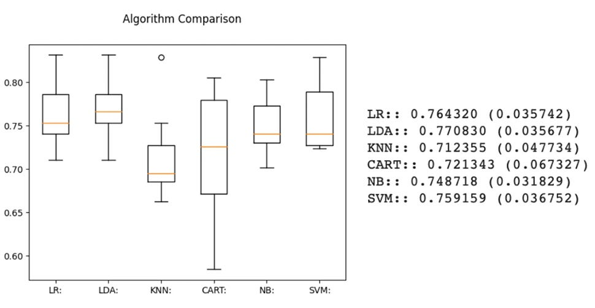
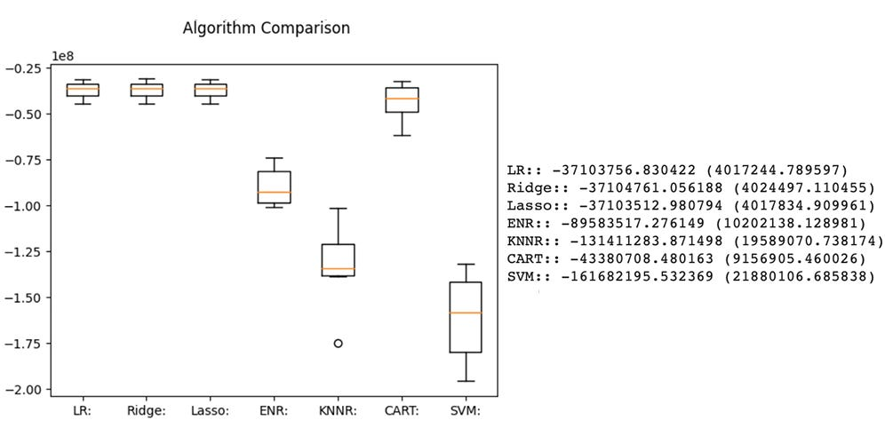

# Comparing Machine Learning Models
For any machine learning problem, we must select an algorithm to make predictions, an evaluation method to estimate a model's performance on unseen data, and an evaluation metric(s) to quantify how well the model works. 

Unfortunately, we can't always know which algorithm will work best on our dataset beforehand. As a result, we have to try several algorithms, then focus our attention on those that seem most promising. Thus, it's important to have quick and easy ways to assess and compare different algorithms' performance before we select one to tune and optimize - this is where spot-checking comes in. 

Spot-checking is a way to quickly discover which algorithms perform well on your machine-learning problem before selecting one to commit to. Generally, I recommend that you spot-check five to ten different algorithms using the same evaluation method and evaluation metric to compare the model's performance. Often you'll notice that a few of your spot-checked algorithms perform much better than the rest. I recommend selecting two to three models with the best performance, then double down and spend time tuning those algorithms to make your predictions increasingly accurate. 

# Algorithm Spot-Checking For Classification Problems:

A classification problem in machine learning is one in which a class label is predicted given specific examples of input data. 

In this article, I will use the Pima Diabetes dataset for my demonstration. The Pima Diabetes dataset is a binary classification problem with two numerical output classes (0 = no diabetes and 1 = diabetes). 

The key to fairly comparing different spot-checked machine learning algorithms is to evaluate each algorithm in the same way, which is achieved with a standardized test harness. In this article, each algorithm we spot-check will be used to predict whether a given patient has diabetes, using k-fold cross-validation and classification accuracy as our evaluation method and evaluation metric, respectively.

Finally, we will spot-check the following six algorithms:

- **Logistic regression**, which is a data analysis technique that uses several known input values to predict a single unknown data point; 
- **Linear discriminant analysis (LDA)((, which makes predictions for both binary and multi-class classification problems; 
- **k-nearest neighbors (KNN)**, which finds the k most similar training data points for a new instance and takes the mean of the selected training data points to make a prediction;
- **Naive bayes (NB)**, which calculates the probability and conditional probability of each class, given each input value, and then estimates these probabilities for new data;
- **Classification and regression trees (CART)**, which construct binary tress from the training data and generate splits to minimize a cost function; and
- **Support vector machine (SVM)**, which seek a line that best separates to classes based on the position of various support vectors.

Below you’ll find sample code spot-checking the six algorithms above and generating a box plot to compare the results:

```
# import libraries
from pandas import read_csv
from sklearn.model_selection import kFold
from sklearn.model_selection import cross_val_score
from sklear.linear_model import LogisticRegression
from sklearn.tree import DecisionTreeClassifier
from sklearn.neighbors import KNeighborsClassifier
from sklearn.discriminant_analysis import LinearDiscriminantAnalysis
from sklearn.naive_bayes import GaussianNB
from sklearn.vsm import SCV
from matplotlib import pyplot

# load data
filename = 'diabetes.csv'
names = ['pregnancies', 'glucose', 'DBP', 'skinfold','insulin','BMI','diabetes_pedigree','age','outcome']
data = read_csv(filename, names=names)

# create array w/ data and seperate array into input/outputs
array = data.values # inputs = all rows in columns 0-7
x = array[:,0:8] # output = all rows in column 8
y= array[:,8]

# prepare models for spot-check and comparison
models= []
model.append(('LR:', LogisticRegression(solver='liblinear')))
model.append(('LDA:', LinearDiscriminantAnalysis()))
model.append(('KNN:', KNeighborsClassifier()))
model.append(('CART:', DecisionTreeClassifier()))
model.append(('NB:', GaussianNB()))
model.append(('SVM:', SVC()))

# evaluate model performance and summarize results
results = []
names = []
scoring = 'accuracy'
for name, model in models:
  kfold = kFold(n_splits=10, random_state=5, shuffle=True)
  cv_results = cross_val_score(model, x, y, cv=kfold, scoring=scoring)
  results.append(cv_results)
  names.append(name)
  read_out = "%s: %f (%f)" % (name, cv_results.mean(), cv_results.std())
  print(read_out)

# create boxplot to compare results
fig = pyplot.figure()
fig.subtitle('Algorithm Comparison')
ax = fig.add_subplot(111)
pyplot.boxplot(results)
ax.set_xticklabels(names)
pyplot.show()
```
Which produces the following output:



Based on these results we can see that linear discriminant analysis (LDA) and logistic regression (LR) produce the best results. Thus, these two algorithms can be selected for tuning and optimization to enhance their ability to make accurate predictions.

# Algorithm Spot-Checking For Regression Problems:

A regression problem in machine learning is one in which a single unknown data point is predicted from related known data points. For example, in this article, I will spot-check a series of algorithms used to predict an individual’s medical costs billed by health insurance using information about the patient’s age, sex, BMI, number of dependents, smoking status, and residential area within the United States. 

The six following algorithms will be spot-checked:

- **Linear regression**, which is a data analysis technique that assumes a linear relationship between known inputs and predicted outputs; 
- **Ridge regression**, which is a modified version of linear regression that, is best used when the independent variables in the data are highly correlated; 
- **LASSO regression**, which is also a modified version of linear regression where the model is penalized for the sum of absolute values of the weights; 
- **ElasticNet regression**, which is a regularized form of regression that combines the characteristics of both ridge and LASSO regression; 
- **k-nearest neighbors (KNN)**, which finds the k most similar training data points for a new instance and takes the mean of the selected training data points to make a prediction; 
- **Classification and regression trees (CART)**, which construct regression trees from the training data and generate splits to minimize a cost function (in this case, MSE); and
- **Support vector machine for regression (SVR)**, which is an extension of SVM for binary classification that has been modified to predict continuous numerical outputs. 

Below you’ll find sample code spot-checking the six algorithms above and generating a box plot to compare the results:

```
# import libraries
from pandas import read_csv
from sklearn.model_selection import kFold
from sklearn.model_selection import cross_val_score
from sklearn.linear_model import LinearRegression
from sklearn.linear_model import Ridge
from sklearn.linear_model import Lasso
from sklearn.linear_model import ElasticNet
from sklearn.neighbors import KNeighborsRegressor
from sklearn.tree import DecisionTreeRegressor
from sklearn.svm import SVR

# load data
fileame = 'insurance.csv'
names = ['age', 'sex', 'bmi', 'dependents', 'smoker', 'region', 'cost']
data = read_csv(filename, names=names)

# create array w/ data and seperate array into input/outputs
array = data.values
x = array[:, 0:6] # inputs = all rows in columns 0-6
y = array[:, 6] # output = all rows in column 7

# prepare models for spot-check and comparison
models = []
models.append(('LR:', LinearRegression()))
models.append(('Ridge:', Ridge()))
models.append(('Lasso:', Lasso()))
models.append(('ENR:', ElasticNet()))
models.append(('KNNR:', kNeighborsRegressor()))
models.append(('CART:', DecisionTreeRegressor()))
models.append(('SVM:', SVR()))

# evaluate model performance and summarize results
results = []
names = []
scoring = 'neg_mean_squared_error'
for name, model in models:
  kfold = kFold(n_splits=10, random_state=5, shuffle=True)
  cv_results = cross_val_score(model, x, y, cv=kfold, scoring=scoring)
  results.append(cv_results)
  names.append(name)
  read_out = "%s: %f (%f)" (name, cv_results.mean(), cv_results.std())
  print(read_out)

# create boxplot to compare results
fig = pyplot.figure()
fix.subtitle('Algorithm Comparison')
ax = fig.add_subplot(111)
pyplot.boxplot(results)
ax.set_xticklabels(names)
pyplot.show()
```
Which produces the following output:



Based on these results we can see that LASSO, ridge, and linear regression produce the best results. Thus, these three algorithms can be selected for tuning and optimization to enhance their ability to make accurate predictions.

# Closing Thoughts
In this tutorial you learned how to spot-check algorithms with a standardized test harness, then compare the results to determine which algorithms to select for tuning and optimization.

You can find the code and data from this article [here](https://github.com/evanpeikon/Machine-Learning/tree/main/spot_checking/code), which can be used as a template for  evaluating algorithms for your own classification and regression problems.

